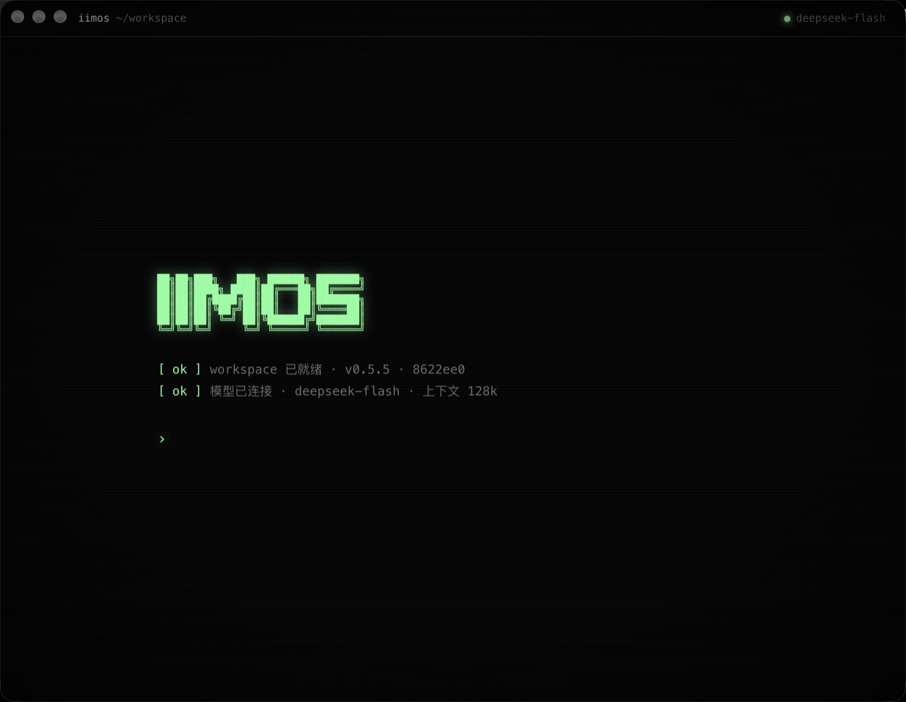

# iimos

**住在你电脑里的 Agent。出厂只有一个对话,其余的一切都在对话里长出来。**

你要一个功能、一块界面、一种工作方式,它就把自己改成那样 —— 它能读自己的源码,
改自己的界面、服务、工具,甚至改自己的提示词。改完,它就变了。
所以世上没有两份一样的 iimos,每一份都是它主人的形状。



- **全部在本机。** Agent、代码、数据都在你的电脑上,没有账号,没有云端。
- **模型用你自己的。** 任何兼容 OpenAI Responses 协议的服务:填地址、API Key、模型名就行。
- **改坏了能救回来。** 每次改动前自动快照;起不来就回滚到上一个好版本,还有一个独立的救援窗口。

## 试一试

打开后,在提示符里直接说:

```text
右边加一个待办列表
换成拟物风格,老式仪器面板那种
给我一个读网页的工具
```

它会改自己的代码、重载窗口,然后告诉你多了什么、怎么用。

## 安装

macOS:从 [Releases](https://github.com/yanglongyun/iimos/releases) 下载 dmg。
第一次打开时在对话里填模型配置(服务地址、API Key、模型名、上下文窗口大小)。

API Key 只存在本机 `config.json`(权限 600),只发往你填的那个地址。

## 它是怎么做到的

```text
launcher/   安装包里唯一不变的部分。找到 workspace → 首次播种 / 升级 → 启动记账 → 加载 app
            启动前快照;同一版本连续两次没报到就回滚,坏版本留成 crashed-* 分支
            `iimos` 命令:status / snapshot / log / diff / rollback / reload / restart / add
            救援窗口:不加载 app 的任何代码,带回滚、恢复出厂和一个独立的救援 agent

app/        出厂的应用(种子)。首次打开时拷进 <数据目录>/workspace/(一个 git 仓库),
            之后 agent 改的都是那一份。出厂只有一个对话:
  desktop/  起本地服务 → 开窗口 → 向 launcher 报到
  server/   本地服务:只听 127.0.0.1,接口要令牌;对话、事件流
  ai/       模型请求(Responses 流式,失败自动重试)
  agent/    agent 循环;工具 shell / read / write / edit;上下文到 70% 自动压缩;prompt.md 是它的基础提示词
  ui/       界面:React + TSX,改完 `iimos reload` 由 launcher 带的 esbuild 编译,编不过就不换
  AGENT.md  agent 自己维护的说明,写给下一次的它自己
```

app 唯一要守的契约(详见 [launcher/CONTRACT.md](launcher/CONTRACT.md)):起来后向 launcher 报到;
用户数据放 `$IIMOS_DATA`,不放 workspace。其余全都可以改。

数据目录(macOS):`~/Library/Application Support/ai.iimos.desktop/`
—— `workspace/`(应用代码,git 仓库)· `data/`(对话、模型配置,回滚不动它)· `launcher/`(账本、日志)。

救援窗口:⌘⌥⇧R(Windows/Linux:Ctrl+Alt+Shift+R),或 `--recovery` 启动参数。

## 从源码跑

需要 Node 22.5+。

```bash
npm install
npm run app
```

用一个临时目录,不碰日常数据:

```bash
IIMOS_HOME=/tmp/iimos-dev npm run app
```

改了仓库里的 `app/` 想让开发用的 workspace 跟上:删掉 `<IIMOS_HOME>/workspace` 重新播种,
或者把 `app/package.json` 的 version 加一,下次启动按升级处理。

```bash
npm test                # launcher 的播种 / 回滚 / 升级 + app 的端到端(假模型)
npm run build:app       # 打包,未签名,自己用
npm run ship:mac        # 签名 + 公证 + 验证
```

## 许可

[MIT](LICENSE)
