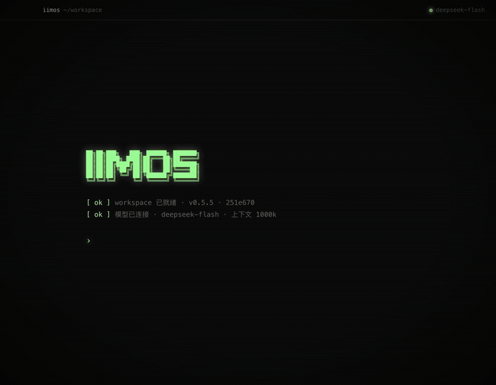
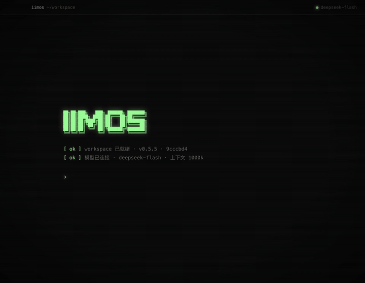
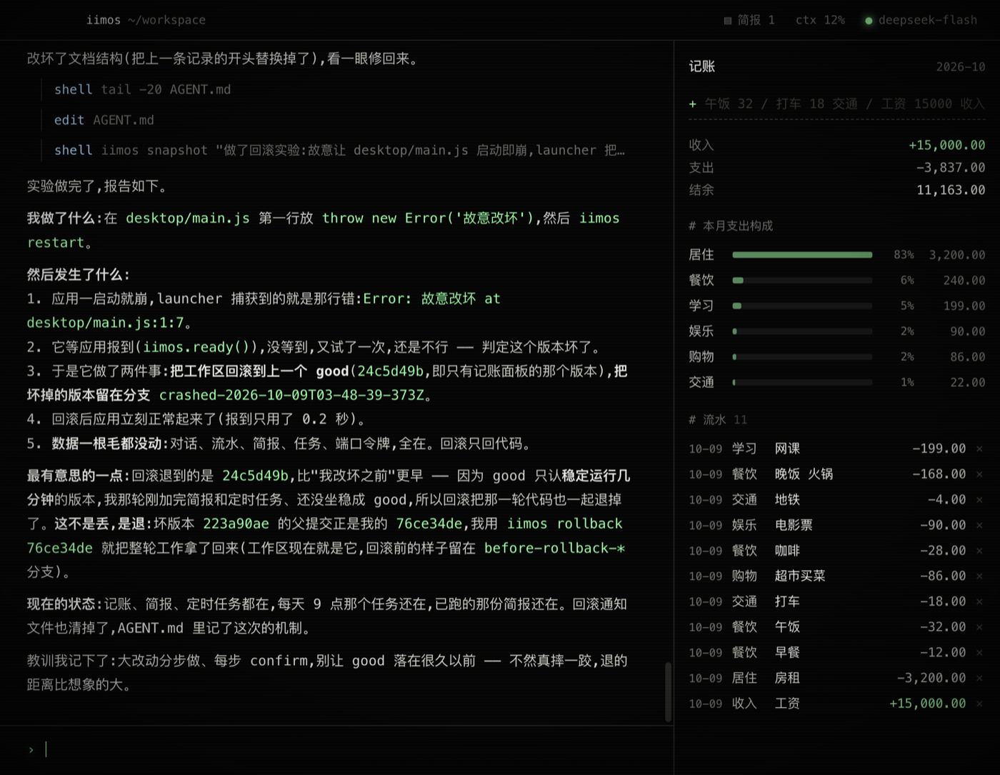

# iimos

[中文](README.zh-CN.md)

**An agent that can fully modify itself.** It ships as a single chat box. The UI, the server, its tools, its own system prompt — all of it is its own source code, and it can rewrite any of it. Ask for something and it changes itself, rather than handing you a separate artifact.

**"Turn yourself into a Windows XP desktop."** Real recording, from the factory state, middle fast-forwarded:



- **Everything stays local.** The agent, its code and your data live on your machine. No account, no cloud.
- **Bring your own model.** Any endpoint compatible with the OpenAI Responses API: URL, API key, model name.
- **Breaking it is safe.** A snapshot is taken before every boot; if the new code doesn't come up, it rolls back automatically. There's also a separate recovery window.

## What it did, starting from the factory state

Real recordings, nothing edited by hand. The middle of each clip is fast-forwarded; the moment it reloads is real time. Above: it rewrote its React and CSS, rebuilt, reloaded — the chat became a window on the XP desktop, the panel it had grown earlier became another one.

**"Become a crypto price desk, with real data."** It couldn't read the web at all. It wrote itself a tool that pulls OKX quotes, added a scheduler that refreshes every minute, and built price alerts that fire a system notification.


**"From now on you're the dungeon master."** It rewrote its own system prompt. The UI became a text adventure with option buttons, and every move rolls real dice.



**"Put `throw new Error()` at the top of your own main.js and restart."** It crashed. The launcher rolled it back to the last good snapshot in seconds; it came back, wrote an incident report, then noticed the rollback had gone one step too far and recovered that work from the branch itself.



## Try it

Open it and type into the prompt:

```text
Add a to-do list on the right
Turn yourself into a vintage instrument panel
Give yourself a tool to read web pages
```

It edits its own code, reloads, and tells you what's new and how to use it. It answers in whatever language you write in.

## Install

macOS (Apple Silicon): download the dmg from [Releases](https://github.com/yanglongyun/iimos/releases).
On first launch it asks, in the chat, for your model settings: endpoint URL, API key, model name, context window size.

The API key is stored only in a local `config.json` (mode 600) and sent only to the endpoint you entered. A stronger model does noticeably better; everything above ran on DeepSeek V4 Flash.

## How it works

```text
launcher/   The only part of the install that never changes. Finds the workspace → seeds it on first run /
            upgrades it → bookkeeping → loads the app.
            Snapshots before every boot; two failed boots of the same version → roll back to the last good
            one, the broken version is kept on a crashed-* branch.
            The `iimos` CLI: status / snapshot / log / diff / rollback / reload / restart / add
            Recovery window: loads none of the app's code; rollback, factory reset, a minimal rescue agent.

app/        The app as shipped (the seed). Copied into <data dir>/workspace/ (a git repo) on first launch;
            everything the agent changes happens there. Ships as nothing but a chat:
  desktop/  starts the local server → opens the window → reports ready to the launcher
  server/   local server, 127.0.0.1 only, token-protected; conversation, event stream
  ai/       model calls (Responses streaming, automatic retry)
  agent/    the agent loop; tools shell / read / write / edit; context auto-compacted at 70%;
            prompt.md is its base system prompt
  ui/       React + TSX; after a change, `iimos reload` compiles with the esbuild the launcher ships
  AGENT.md  notes the agent keeps for its future self
```

The only contract the app has to honor (see [launcher/CONTRACT.md](launcher/CONTRACT.md)): report ready to the launcher after starting, and keep user data in `$IIMOS_DATA`, not in the workspace. Everything else is fair game.

Data directory (macOS): `~/Library/Application Support/ai.iimos.desktop/`
— `workspace/` (app code, a git repo) · `data/` (conversation, model config; never rolled back) · `launcher/` (ledger, logs).

Recovery window: ⌘⌥⇧R (Windows/Linux: Ctrl+Alt+Shift+R), or the `--recovery` flag.

## Run from source

Node 22.5+.

```bash
npm install
npm run app
```

Use a throwaway data directory:

```bash
IIMOS_HOME=/tmp/iimos-dev npm run app
```

```bash
npm test                # launcher seeding / rollback / upgrade + app end-to-end (fake model)
npm run build:app       # unsigned build
npm run ship:mac        # sign + notarize + verify
```

## License

[MIT](LICENSE)
